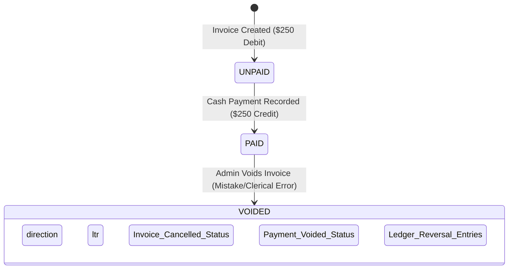
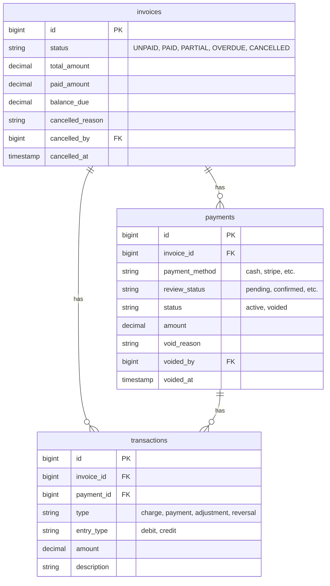

# Paid Invoice Void System: Architectural Design & Business Logic Analysis

This document provides a highly detailed system design and business logic analysis for implementing a robust, GAAP-compliant **Paid Invoice Void System** within the application. Specifically, it focuses on the client's requirement to allow administrators to void already-paid invoices, restricted exclusively to those paid via **CASH**.

---

## 1. Executive Summary & Core Conflict

In high-integrity financial and property management systems, **data must be immutable**. Simply deleting payments or resetting invoices to `UNPAID` destroys the audit trail, creates discrepancies in historical reports, and makes cash drawer reconciliation impossible.

### The Core Scenario
* A lease has invoices totaling $1,000.
* One invoice of $250 is marked as `PAID` via `CASH` by mistake.
* The administrator voids this invoice.

### Financial and Accounting Resolution
1. **The $250 must be removed from Total Income (Revenue)** because the transaction was a clerical error and the income is non-existent.
2. **The physical payment must NOT be deleted** from the database. Instead, it must be marked as `voided` or `reversed` and balanced out with a debit entry.
3. **The ledger must balance**. The original Debit (Invoice) and Credit (Payment) are neutralized using matching offset entries.
4. **The lease balance must NOT reopen for this invoice**. The voided invoice is permanently dead. Its balance due is $0. (A corrected invoice should be issued separately to collect actual rent).

---

## 2. Business Logic Analysis & Accounting Alignment

Real-world accounting systems (e.g., Stripe Billing, QuickBooks, Xero) handle paid invoice voids through **Reversal Transactions** and **Status Transitions** rather than destructive SQL deletions.

### Detailed Lifecycle of the Mistaken Invoice


### Direct Answers to Your Core Questions

| Question | Accounting/SaaS Best Practice Response | Technical Implementation Detail |
| :--- | :--- | :--- |
| **What should happen financially after voiding?** | The net income of the business and the tenant's balance due must return to the state they were in prior to the mistaken invoice. However, the gross ledger volume will show both the original and reversing entries. | Generate matching offsetting `Transaction` records. Gross debit = $500, Gross credit = $500, Net = $0. |
| **Should the $250 be removed from total income?** | **Yes.** Since it was recorded in error and no physical cash was received, leaving it in income would inflate revenue and result in inaccurate tax/financial reporting. | Exclude payments with `status = 'voided'` or associated with voided invoices from daily/monthly revenue sums. |
| **How should ledger, reports, and payment history behave?** | They must preserve the history. The original payment must remain visible but crossed-out or designated as `VOID`. Reversal ledger entries must offset the original balances. | Update payment `status` to `'voided'`. Do not delete the database row. In reports, display the row but flag it as `VOID` and set its net impact to `$0.00`. |
| **Should the lease balance automatically reopen?** | **No.** Because the invoice itself is voided (cancelled), its balance due is $0. It does not demand future payment. If the tenant still owes rent, it must be tracked on the new, corrected invoice. | Invoice status becomes `'CANCELLED'` (or `'VOIDED'`), and `balance_due` is updated/kept at `$0.00`. |
| **Should the voided payment create a reversal transaction?** | **Yes.** In double-entry bookkeeping, you cannot have a payment reversal without a ledger transaction. | Create a `Transaction` of type `'reversal'` with `entry_type = 'debit'` to offset the original payment's credit. |

---

## 3. Database Schema Updates

To prevent database deletions and maintain comprehensive accountability, we introduce a structured status for payments and link void audits directly to the database.



### Migration Specification
We will add payment status fields and establish proper indices.

```php
Schema::table('payments', function (Blueprint $table) {
    $table->string('status')->default('active')->after('review_status'); // active, voided
    $table->string('void_reason')->nullable()->after('note');
    $table->foreignId('voided_by')->nullable()->after('recorded_by')->constrained('users');
    $table->timestamp('voided_at')->nullable()->after('void_reason');

    $table->index(['status', 'payment_date']);
});
```

---

## 4. Double-Entry Ledger Transaction Flow

When a cash-paid invoice of **$250** is voided, the ledger must log balancing reversal entries.

### Ledger Entry Progression

#### 1. Invoice Creation (Original Charge)
* **Action**: Invoice `INV-001` issued for **$250**.
* **Accounting Ledger Entry**:
  * **Debit**: Accounts Receivable (Tenant Balance) increases by **$250**.
  * **Credit**: Rental Revenue increases by **$250**.
  * **Code Implementation**:
    ```php
    Transaction::create([
        'type' => 'charge', 'entry_type' => 'debit', 'amount' => 250.00, 'description' => 'Invoice charge'
    ]);
    ```

#### 2. Cash Payment Recorded
* **Action**: Cash payment `PAY-001` of **$250** is applied.
* **Accounting Ledger Entry**:
  * **Debit**: Cash Drawer (Assets) increases by **$250**.
  * **Credit**: Accounts Receivable (Tenant Balance) decreases by **$250**. (Net Balance Due = $0).
  * **Code Implementation**:
    ```php
    Transaction::create([
        'type' => 'payment', 'entry_type' => 'credit', 'amount' => 250.00, 'description' => 'Cash payment'
    ]);
    ```

#### 3. Admin Voids the Paid Cash Invoice
* **Action**: Admin voids the paid cash invoice.
* **Accounting Ledger Entry**:
  * **Debit Reversal (Invoice Void)**: Credit Accounts Receivable by **$250** to write off the invoice. Debit Rental Revenue by **$250** to reduce income.
  * **Credit Reversal (Payment Reversal)**: Debit Accounts Receivable by **$250** to reverse the cash application. Credit Cash Drawer by **$250** to subtract the ghost money from assets.
  * **Code Implementation**:
    ```php
    // Reversal Transaction 1: Void the invoice (write off debit)
    Transaction::create([
        'type' => 'reversal',
        'entry_type' => 'credit',
        'amount' => 250.00,
        'description' => 'Invoice INV-001 voided - outstanding charge written off',
        'notes' => $reason
    ]);

    // Reversal Transaction 2: Reverse the payment (write off credit)
    Transaction::create([
        'type' => 'reversal',
        'entry_type' => 'debit',
        'amount' => 250.00,
        'description' => 'Payment PAY-001 reversed due to invoice void',
        'notes' => $reason
    ]);
    ```

---

## 5. Security & Permission Controls

Voiding a paid invoice is a high-risk administrative action. The system must restrict this capability using Laravel policies and roles.

### Access Restrictions
* **Role Enforcements**: Only `super admin` or roles with designated accounting credentials (e.g., `accounting head`) may execute voids.
* **Payment Method Restriction**: The request must fail with a `422 Unprocessable Entity` if the invoice contains *any* payment method other than `cash`.
* **State Enforcements**: The invoice must be in `PAID` or `PARTIAL` status. Already-cancelled invoices must be rejected.

### Policy Recipe (`app/Policies/InvoicePolicy.php`)
```php
public function voidPaidCash(User $user, Invoice $invoice): bool
{
    // Must be Super Admin or Accounting Admin
    if (!$user->hasRole('super admin') && !$user->hasPermissionTo('void paid invoices')) {
        return false;
    }

    // Must be paid or partially paid
    if (!in_array($invoice->status, ['PAID', 'PARTIAL'])) {
        return false;
    }

    // Must have at least one payment and ALL payments must be cash
    if ($invoice->payments->isEmpty()) {
        return false;
    }

    return $invoice->payments->every(function ($payment) {
        return strtolower($payment->payment_method) === 'cash';
    });
}
```

---

## 6. Daily Collection & Reporting Logic

The daily collection report aggregates physical and digital cash flows for a specific calendar day.

### Core Requirements
1. Voided cash payments **must remain on the report** for transparency.
2. The report **must label the payment status as "VOID"**.
3. The voided payment **must NOT be summed** into the total collections.

### SQL / Eloquent Query Implementation
To capture voided payments while preserving financial accuracy, use conditional aggregates:

```php
$payments = Payment::query()
    ->whereBetween('payment_date', [$startDate, $endDate])
    ->with(['invoice', 'tenant.profile'])
    ->get();

// Calculate Totals Safely
$totalCollected = $payments->where('status', 'active')->sum('amount');
$totalVoided    = $payments->where('status', 'voided')->sum('amount');
```

### Table Render Representation (Blade / HTML / PDF / Excel)
```html
<table class="table">
    <thead>
        <tr>
            <th>Payment No</th>
            <th>Invoice No</th>
            <th>Tenant</th>
            <th>Method</th>
            <th>Gross Amount</th>
            <th>Status</th>
            <th>Action/Notes</th>
        </tr>
    </thead>
    <tbody>
        @foreach($payments as $payment)
            <tr class="{{ $payment->status === 'voided' ? 'text-decoration-line-through text-muted table-danger' : '' }}">
                <td>{{ $payment->payment_number }}</td>
                <td>{{ $payment->invoice->invoice_number }}</td>
                <td>{{ $payment->tenant->profile->full_name }}</td>
                <td>{{ ucfirst($payment->payment_method) }}</td>
                <td>
                    @if($payment->status === 'voided')
                        <span class="badge bg-danger">-$250.00 (VOID)</span>
                    @else
                        ${{ number_format($payment->amount, 2) }}
                    @endif
                </td>
                <td>
                    <span class="badge {{ $payment->status === 'voided' ? 'bg-danger' : 'bg-success' }}">
                        {{ strtoupper($payment->status) }}
                    </span>
                </td>
                <td>
                    @if($payment->status === 'voided')
                        <small class="text-danger">Voided by {{ $payment->voidedBy->name }}: "{{ $payment->void_reason }}"</small>
                    @else
                        -
                    @endif
                </td>
            </tr>
        @endforeach
    </tbody>
</table>
```

---

## 7. API Structure & Validation Rules

### Endpoint: `POST /api/backend/invoices/{id}/void-paid-cash`

#### Request Validation Rules
```php
$request->validate([
    'reason' => [
        'required',
        'string',
        'min:10',
        'max:1000'
    ]
]);
```

#### API Success Response (`200 OK`)
```json
{
    "success": true,
    "message": "Paid cash invoice successfully voided. Transactions reversed.",
    "data": {
        "invoice_id": 482,
        "invoice_number": "INV-2026-0042",
        "status": "CANCELLED",
        "total_amount": 250.00,
        "paid_amount": 0.00,
        "balance_due": 0.00,
        "cancelled_at": "2026-05-19T10:35:10Z",
        "cancelled_by_name": "Jane Admin",
        "cancelled_reason": "Mistaken double-billing; correct invoice created separately.",
        "reversed_payments": [
            {
                "payment_number": "PAY-00891",
                "amount": 250.00,
                "status": "voided",
                "voided_at": "2026-05-19T10:35:10Z"
            }
        ],
        "reversal_transactions": [
            {
                "transaction_number": "TXN-00028911",
                "entry_type": "credit",
                "amount": 250.00,
                "description": "Invoice INV-2026-0042 voided - outstanding charge written off"
            },
            {
                "transaction_number": "TXN-00028912",
                "entry_type": "debit",
                "amount": 250.00,
                "description": "Payment PAY-00891 reversed due to invoice void"
            }
        ]
    }
}
```

---

## 8. Step-by-Step Implementation Recipe

### Step 1: Database Migration
Create a migration to modify the `payments` table and index it for quick filtering in reports.
```bash
php artisan make:migration add_void_fields_to_payments_table
```

### Step 2: Implement Controller Method in `InvoiceController.php`
Replace the destructive `cancelPaidCashPayment` with an atomic, audit-compliant voiding method.

```php
/**
 * Void an already paid cash invoice.
 * Adheres strictly to audit-log integrity. Offsets ledger transactions.
 */
public function voidPaidCashInvoice(Request $request, $id)
{
    $request->validate([
        'reason' => 'required|string|min:10|max:1000',
    ]);

    $currentUser = Auth::user();

    // 1. Role Enforcement
    if (!$this->isSuperAdmin($currentUser->id)) {
        return response()->json([
            'success' => false,
            'message' => 'Unauthorized: Only Master Admins can execute a paid cash invoice void.'
        ], 403);
    }

    DB::beginTransaction();
    try {
        // 2. Fetch with pessimistic lock to prevent race conditions during transaction adjustments
        $invoice = Invoice::lockForUpdate()->with(['lease.assignments', 'payments'])->findOrFail($id);

        // 3. State & Payment Method Enforcements
        if (!in_array($invoice->status, ['PAID', 'PARTIAL'])) {
            return response()->json([
                'success' => false,
                'message' => 'Only PAID or PARTIALLY PAID invoices can be voided via this action.'
            ], 422);
        }

        if ($invoice->payments->isEmpty()) {
            return response()->json([
                'success' => false,
                'message' => 'No payment record exists for this invoice.'
            ], 422);
        }

        $nonCashPayments = $invoice->payments->filter(function ($payment) {
            return strtolower($payment->payment_method) !== 'cash';
        });

        if ($nonCashPayments->isNotEmpty()) {
            return response()->json([
                'success' => false,
                'message' => 'This operation is restricted exclusively to cash-paid invoices.'
            ], 422);
        }

        $now = now();
        $bedId = $invoice->lease->assignments()->where('is_current', true)->value('bed_id');
        $paymentAmount = (float) $invoice->payments->where('status', 'active')->sum('amount');

        // 4. Update Invoice Status to Cancelled & Audit Fields
        $invoice->update([
            'status' => 'CANCELLED',
            'paid_amount' => 0.00,
            'balance_due' => 0.00, // Reversal neutralizes outstanding debt; balance is $0
            'cancelled_reason' => $request->reason,
            'cancelled_by' => $currentUser->id,
            'cancelled_at' => $now,
        ]);

        // 5. Update Payments to VOIDED instead of deleting
        foreach ($invoice->payments as $payment) {
            if ($payment->status !== 'voided') {
                $payment->update([
                    'status' => 'voided',
                    'void_reason' => $request->reason,
                    'voided_by' => $currentUser->id,
                    'voided_at' => $now,
                ]);
            }
        }

        // 6. Handle First Invoice Deposit Status Reversal
        if (
            $invoice->lease &&
            $invoice->is_first_invoice &&
            $invoice->includes_deposit &&
            $invoice->lease->deposit_collected
        ) {
            $invoice->lease->update(['deposit_collected' => false]);
        }

        // 7. Write Ledger Offset Transactions
        // Reversal Transaction A (Neutralize the Invoice Debit)
        $txnA = Transaction::create([
            'tenant_id' => $invoice->tenant_id,
            'bed_id' => $bedId,
            'lease_id' => $invoice->lease_id,
            'invoice_id' => $invoice->id,
            'transaction_number' => $this->generateTransactionNumber(),
            'type' => 'reversal',
            'entry_type' => 'credit',
            'amount' => $invoice->total_amount,
            'transaction_date' => $now->toDateString(),
            'description' => 'Invoice ' . $invoice->invoice_number . ' voided — original charge written off',
            'notes' => $request->reason,
            'metadata' => [
                'voided_by' => $currentUser->id,
                'voided_at' => $now->toISOString(),
                'original_invoice_total' => $invoice->total_amount,
            ],
        ]);

        // Reversal Transaction B (Neutralize the Payment Credit)
        foreach ($invoice->payments as $payment) {
            Transaction::create([
                'tenant_id' => $invoice->tenant_id,
                'bed_id' => $bedId,
                'lease_id' => $invoice->lease_id,
                'invoice_id' => $invoice->id,
                'payment_id' => $payment->id,
                'transaction_number' => $this->generateTransactionNumber(),
                'type' => 'reversal',
                'entry_type' => 'debit',
                'amount' => $payment->amount,
                'transaction_date' => $now->toDateString(),
                'description' => 'Payment ' . $payment->payment_number . ' reversed due to invoice void',
                'notes' => $request->reason,
                'metadata' => [
                    'voided_by' => $currentUser->id,
                    'voided_at' => $now->toISOString(),
                    'reversed_payment_amount' => $payment->amount,
                ],
            ]);
        }

        DB::commit();

        return response()->json([
            'success' => true,
            'message' => 'Paid cash invoice has been voided successfully. Offset entries posted.',
            'invoice' => $invoice->fresh()
        ]);

    } catch (\Exception $e) {
        DB::rollBack();
        Log::error('Failed to void paid cash invoice: ' . $e->getMessage());
        return response()->json([
            'success' => false,
            'message' => 'System error: Failed to complete void action. ' . $e->getMessage()
        ], 500);
    }
}
```

### Step 3: Update `RentCollectionReportController.php`
Adjust statistics and export filters to include voided items while excluding their totals:

```php
// In getSummary() and getReportData() methods:
// 1. Total active collections sum:
$totalCollected = $query->where('payments.status', 'active')->sum('amount');

// 2. In DT mapping or exporting:
$paymentAmount = $payment->status === 'voided' ? 0.00 : $payment->amount;
```

---

## 9. Accounting Compliance Summary

By implementing this architecture, the application moves from an informal tracking database to a **production-grade financial system** compliant with standard accounting standards (GAAP/IFRS).

1. **Audit Trace**: Historical collections are reconciled perfectly. Any accountant looking at a daily deposit will understand why $250 is missing without suspecting fraud.
2. **Mistake Resolution**: Errors are easily corrected through clear administrative actions.
3. **Data Integrity**: Deletion is prohibited. The database state remains consistent and verifiable.
